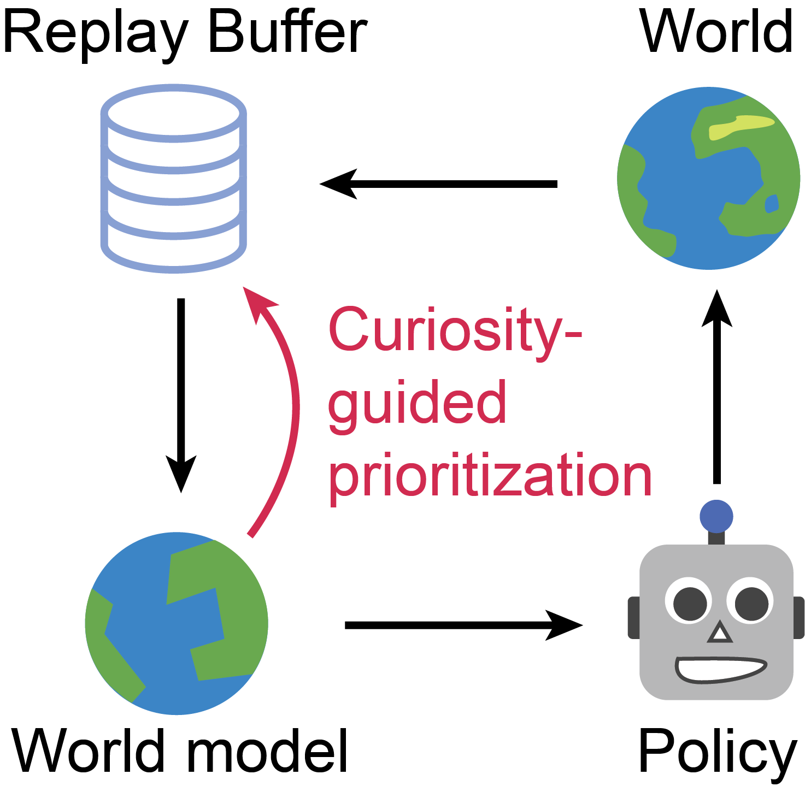

# Curious Replay for Model-based Adaptation

Implementation of Curious Replay with the [DreamerV2](https://danijar.com/dreamerv2) agent in TensorFlow 2. 

<p align="center">

</p>

If you find this code useful, please reference in your paper:

```
@article{kauvar2023curious,
  title={Curious Replay for Model-Based Adaptation},
  author={Kauvar, Isaac and Doyle, Chris and Zhou, Linqi and Haber, Nick},
  journal={},
  year={2023}
}
```


## Method

Curious Replay prioritizes sampling of past experiences for training the agent's world model, 
by focusing on the experiences that are most interesting to the agent - 
whether because they are unfamiliar or surprising. 
Inspired by the concept of curiosity, which is often used as an intrinsic reward to guide action selection, 
here curiosity signals are used to guide selection of what experiences the agent should learn from (i.e. train its model with). 

Curious Replay is a simple modification to existing agents that use experience replay -- with minimal 
computational overhead -- by leveraging a count of how many times an experience has been sampled 
and the model losses that are computed for each training batch. 

This prioritization is especially helpful in changing environments, where adaptation is necessary. 
Curious Replay helps keep the world model up to date as the environment changes, which is
a prerequisite for effective action selection in model-based architectures. 


- [Project website](https://sites.google.com/view/curious-replay)
- [Research paper]()


## Installation Instructions

To install the DreamerV2 agent with Curious Replay, clone the repository, enter the directory, and follow the instructions
below. 

```
conda create -n curiousreplay-dv2 python=3.8 -y
conda activate curiousreplay-dv2
pip3 install tensorflow==2.6.0 tensorflow_probability==0.14.0 \
             protobuf==3.20.3 ruamel.yaml \
             'gym[atari]' dm_control crafter \
             keras==2.6 matplotlib pandas numpy==1.19.5 \
             starr==0.2.1 elements==0.3.2 moviepy
```

## Experiment Instructions

---
Train on **Crafter with Curious Replay** (using optimized hyperparameter):
```sh
python3 dreamerv2/train.py --logdir ~/logdir/crafter/dreamerv2_cr/1 \
  --configs crafter --task crafter_reward  \
  --prioritize_until -1 --priority_params.metric CR \
  --priority_params.a 0.5
```

Monitor results:

```sh
tensorboard --logdir ~/logdir
```


Summarize crafter run:

```sh
python3 dreamerv2/plot_crafter.py
```

Train on **Crafter with Temporal Difference (TD)** Prioritized Experience Replay:
```sh
python3 dreamerv2/train.py --logdir ~/logdir/crafter/dreamerv2_td/1 \
  --configs crafter --task crafter_reward  \
  --prioritize_until -1 --priority_params.metric TD
```

To train on Crafter with **8x increased training frequency** (takes a long time):
```sh
python3 dreamerv2/train.py --logdir ~/logdir/crafter/dreamerv2_cr/1 \
  --configs crafter --task crafter_reward \
  --prioritize_until -1 \
  --priority_params.metric CR \
  --train_steps 8
```
---
Train on **DM Control**:
```sh
python3 dreamerv2/train.py --logdir ~/logdir/dmc_walker_walk/dreamerv2_cr/1 \
  --configs dmc_vision --task dmc_walker_walk \
  --prioritize_until -1  --priority_params.metric CR
```

Note: if running headless and you get this error with DM Control: `ImportError: Cannot initialize a headless EGL display`, you can run:
```sh
sudo killall Xorg
sudo /usr/bin/X :0 &
```
and potentially
```sh
export DISPLAY=:0
```
and potentially
```sh
sudo nvidia-xconfig -a --use-display-device=none
```
---
Train on **Object Interaction Assay** (requires installing adaptgym library, which can sometimes add complication):
```sh
# Mujoco may need to be installed at this point. We are working on improving adaptgym to reduce this complexity. 
pip install numpy==1.22
pip install --index-url https://test.pypi.org/simple/ --extra-index-url https://pypi.org/simple adaptgym==0.1.34 --no-cache-dir
````
```sh
python3 dreamerv2/train.py --logdir ~/logdir/admc_sphero_novel_object/dreamerv2_cr/1 \
  --configs adaptgym --task admc_sphero_novel_object \
  --prioritize_until -1  --priority_params.metric CR
  
python3 dreamerv2/plot_object_interaction.py \
  --logdir ~/logdir/admc_sphero_novel_object/dreamerv2_cr/1 \
  --outdir ~/logdir/admc_sphero_novel_object/dreamerv2_cr/1/plots  
```

Train on **Unchanging Object Interaction Assay** 
```sh
python3 dreamerv2/train.py --logdir ~/logdir/admc_sphero_novel_object_unchanging/dreamerv2_cr/1 \
  --configs adaptgym --task admc_sphero_novel_object_unchanging \
  --prioritize_until -1  --priority_params.metric CR
  
python3 dreamerv2/plot_object_interaction.py \
  --logdir ~/logdir/admc_sphero_novel_object_unchanging/dreamerv2_cr/1 \
  --outdir ~/logdir/admc_sphero_novel_object_unchanging/dreamerv2_cr/1/plots  
```
---


## Acknowledgments

This repository is largely based on the TensorFlow 2 implementation of [DreamerV2](https://github.com/danijar/dreamerv2). 
We would like to thank [Danijar Hafner](https://danijar.com/) for releasing and updating his clean implementation.


### Files modified for incorporating Curious Replay
Those wishing to incorporate Curious Replay into additional agents may find it helpful to know the files that
were modified from the original [DreamerV2](https://danijar.com/dreamerv2): 

`replay.py`, `train.py`, `agent.py`, `configs.yaml`, `expl.py`


## Tips

- **Efficient debugging.** You can use the `debug` config as in `--configs
crafter debug`. This reduces the batch size, increases the evaluation
frequency, and disables `tf.function` graph compilation for easy line-by-line
debugging.

- **Infinite gradient norms.** This is normal and described under loss scaling in
the [mixed precision][mixed] guide. You can disable mixed precision by passing
`--precision 32` to the training script. Mixed precision is faster but can in
principle cause numerical instabilities.

- **Accessing logged metrics.** The metrics are stored in both TensorBoard and
JSON lines format. You can directly load them using `pandas.read_json()`. The
plotting script also stores the binned and aggregated metrics of multiple runs
into a single JSON file for easy manual plotting.

[mixed]: https://www.tensorflow.org/guide/mixed_precision
